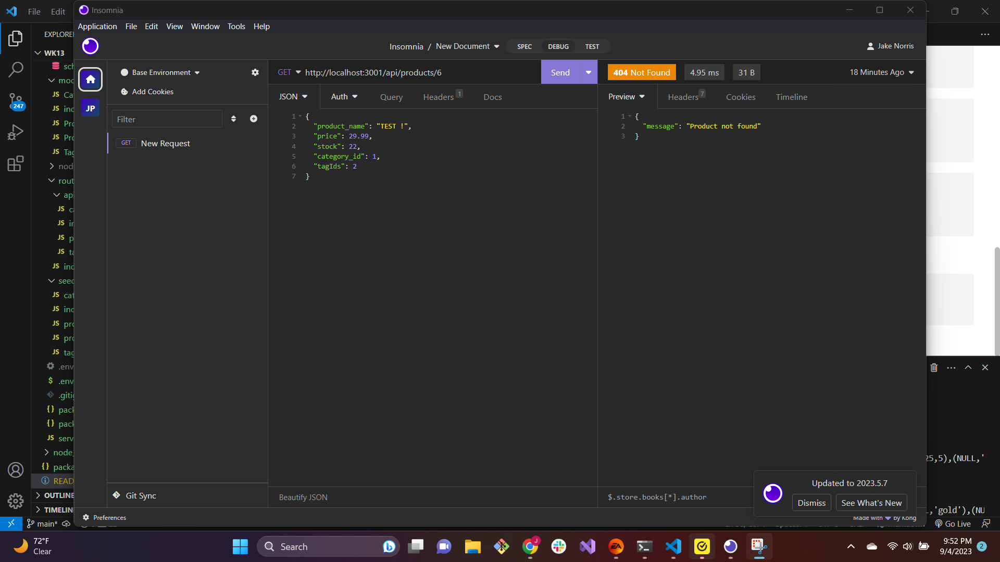

# Ecommerce Backend

## Description

An ecommerce back end for categories product and tags that have correct assocciations and cant create, delete and view all


## Usage

After running schema.sql through mysql, seed using npm run seed, then launch server.js

Routes include:
- Get:
```    
http://localhost:3001/api/categories
http://localhost:3001/api/tags
http://localhost:3001/api/products
```

- Get by ID (replace :Id with valid id number ie: 1, 2 ,3):
```  
http://localhost:3001/api/categories/:Id
http://localhost:3001/api/tags/:Id
http://localhost:3001/api/products/:Id
```

- Post routes with expaples:
```
http://localhost:3001/api/products
{
  "product_name": "example",
  "price": 29.99,
  "stock": 22,
  "category_id": 1,
  "tagIds": 2
}
```
```
http://localhost:3001/api/categories
{
    "category_name" : "example"
}
```

```
http://localhost:3001/api/products
{
    "tag_name" : "test"
}
```
- Delete by ID (replace :Id with valid id number ie: 1, 2 ,3):
```  
http://localhost:3001/api/categories/:Id
http://localhost:3001/api/tags/:Id
http://localhost:3001/api/products/:Id
```

[Video Walkthrough](https://drive.google.com/file/d/153CZ2cHCC_vJntd8jM5c-Edg0NBh8rAD/view)


